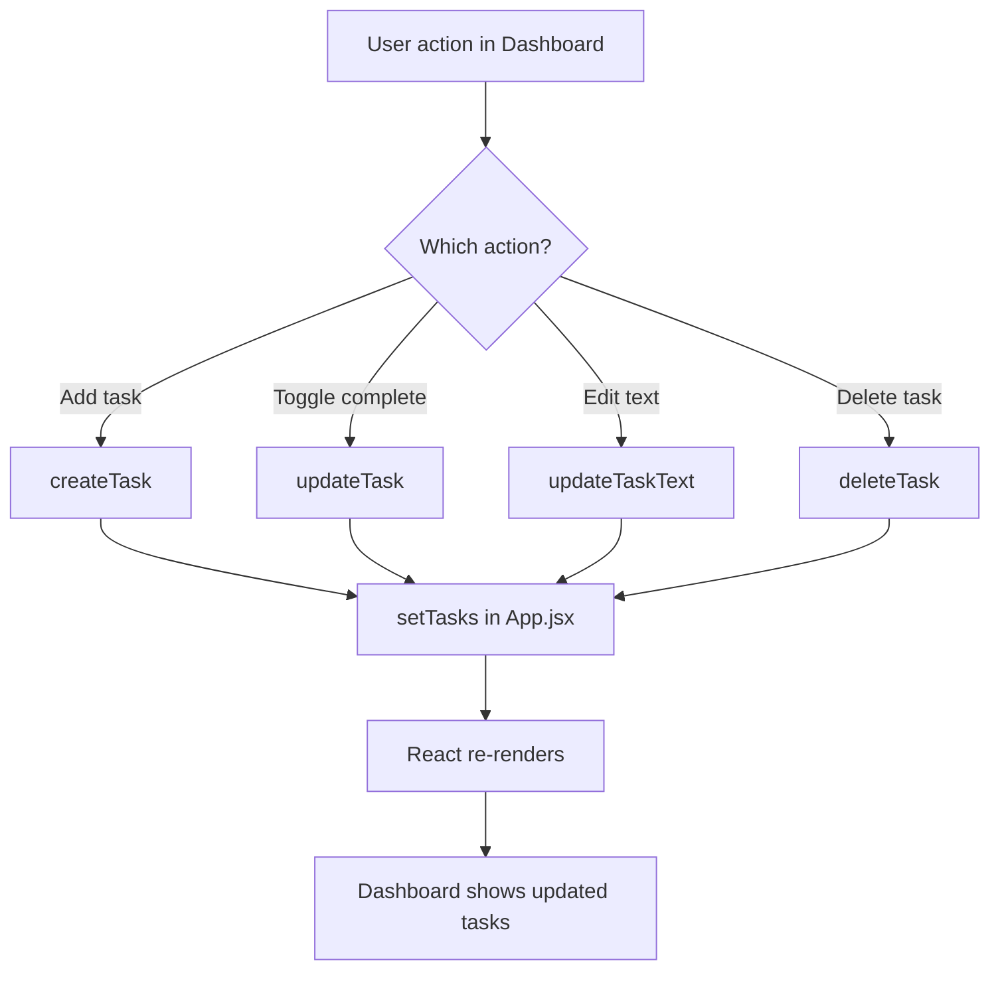

# How This React App Works

## What It Does

This is a task management app. You can:
- Add new tasks
- Mark tasks as done
- Edit task names
- Delete tasks
- View individual task details

---

## Starting Point: App.jsx

This is the main file. It runs when the app starts.

**What happens:**
1. Loads initial tasks from `tasks.json`
2. Stores all tasks in memory
3. Sets up page navigation (routing)
4. Defines 4 functions to manage tasks

**The 4 functions:**
- `createTask` - adds a new task
- `deleteTask` - removes a task
- `updateTask` - toggles completed/not completed
- `updateTaskText` - changes the task name

These functions get passed down to child components.

---

## How Tasks Are Stored

Tasks live in `App.jsx` using React's `useState`.

Each task has 3 properties:
```
id: 1
task: "Read the project brief"
completed: true
```

When you change a task, React updates the list and re-renders the screen.

---

## Main Screen: Dashboard.jsx

This is what you see when you open the app.

**Three sections:**

### 1. Add New Task
- Type in the input box
- Press Enter or click ✚
- Calls `createTask()`
- New task appears instantly

### 2. Task List
Each task shows:
- Checkbox - click to mark done/undone
- Task name - click ✎ to edit
- Delete button (−) - removes the task

### 3. Inline Editing
Click ✎ on any task:
- Input box appears with current name
- Type new name
- Click 💾 to save
- Calls `updateTaskText()`

---

## How Editing Works

**Step by step:**

1. User clicks ✎ button
2. `editingTaskId` remembers which task is being edited
3. `editText` stores what you're typing
4. Input box appears (conditional rendering)
5. User types and clicks 💾
6. `updateTaskText()` updates the task in App.jsx
7. Dashboard re-renders with new name

**Key insight:** The same task list shows either:
- Task name + edit button (when not editing)
- Input field + save button (when editing)

React decides which to show using `editingTaskId === task.id`

---

## Navigation (Routing)

The app has 4 pages:

- `/` - Dashboard (task list)
- `/tasks/:id` - TaskDetails (single task view)
- `/about` - About page
- Anything else - 404 Not Found page

Clicking a task name goes to TaskDetails.
The Navbar has links back to Home and About.

---

## Data Flow

```
App.jsx
  ↓ (passes tasks + functions)
Dashboard.jsx
  ↓ (renders each task)
Task items (checkbox, buttons)
  ↓ (user clicks)
Function gets called
  ↓
App.jsx updates tasks
  ↓
React re-renders everything
  ↓
You see the change
```

**Important:** All task data lives in `App.jsx`. Child components just:
- Display what they're given
- Call functions when users click things

This is called "lifting state up" in React.

---

## Key React Concepts Used

### useState
Stores data that can change. When it changes, React updates the screen.

```jsx
const [tasks, setTasks] = useState(initialTasks);
```

### Props
Data passed from parent to child.

```jsx
<Dashboard tasks={tasks} deleteTask={deleteTask} />
```

Dashboard receives `tasks` and `deleteTask` as props.

### Conditional Rendering
Show different things based on conditions.

```jsx
{editingTaskId === task.id ? <input /> : <span />}
```

If editing this task, show input. Otherwise, show text.

### map()
Loop through tasks and create UI for each one.

```jsx
{tasks.map((task) => <div key={task.id}>...</div>)}
```

---

## File Structure

```
src/
  App.jsx              - Main app, manages all tasks
  main.jsx             - Starts the app
  
  pages/
    Dashboard.jsx      - Main screen (task list)
    TaskDetails.jsx    - Single task view
    About.jsx          - About page
    NotFound.jsx       - 404 page
  
  components/
    tasks/
      Navbar.jsx       - Top navigation
      TaskCard.jsx     - Individual task (not used)
      TaskList.jsx     - Task list (not used)
    Footer.jsx         - Bottom links
  
  data/
    tasks.json         - Initial tasks (loaded once)
```

**Note:** Some files like `TaskCard.jsx` exist but aren't currently used. The Dashboard renders tasks directly.

---

## How To Use This App

### Run it:
```
npm run dev
```

### Add a task:
1. Type in the input box
2. Press Enter

### Edit a task:
1. Click ✎ on any task
2. Type new name
3. Click 💾

### Mark as done:
1. Click the checkbox

### Delete a task:
1. Click the − button

---

## Tech Stack

- **React** - builds the UI
- **Vite** - builds and runs the project (fast)
- **React Router** - handles page navigation
- **CSS** - styling (in index.css)

No database. Tasks reset when you refresh the page.

---

## For Beginners: React Mental Model

Think of React like this:

1. **Components** = Building blocks (like LEGO pieces)
2. **State** = Memory (what the app remembers)
3. **Props** = Passing notes between components
4. **Rendering** = Drawing the screen

When state changes → React redraws → You see updates.

Functions like `deleteTask()` change the state.
React automatically handles the redrawing.

---

## State Flow Diagram


